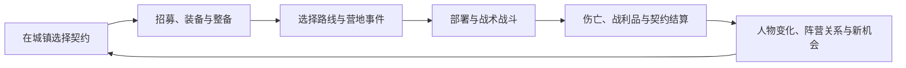

# 总体设计与长期规划 v0.3

日期：2026-09-17。项目目录代号：Fantasy Brothers。创意暂名：《灰烬誓约》；正式名称需在发行筹备时另行确定。

2026-09-18 用户更新优先级：先把整体框架与功能搭起来，再逐步丰富内容。当前执行顺序以 [框架接续计划](10-framework-roadmap.md) 为准；每个功能仍用少量代表数据完成可玩、存档和后果闭环。以下长期方案继续作为候选，不能覆盖最新指令或视作已经实现。

这份方案以用户提出的三个重点为核心：战斗系统、故事剧情、魔幻中世纪画风。团队已明确为用户一名真人与 AI 开发团队；用户希望先把少量机制做深，再增加技能、人物成长、佣兵团类型、驯兽等体系，并提高视觉和动画品质。用户进一步要求事件与成长融入肉鸽变化、PTR 式技能联动、元素反应和场景互动，并确认佣兵团在战役内持续成长，远征失败承担伤亡与损失。具体机制是可试玩验证的设计提案；工期、成本、内容量均为规划假设。

## 1. 建议先做怎样的一款游戏

一句话定位：玩家带领一支在衰败边境求生的佣兵团，通过接下契约、指挥战斗和承担承诺的代价，让一群普通人留下自己的传奇。

首发建议采用 Windows 单机买断制。主要受众是愿意研究阵型、装备和风险取舍，同时希望记住队员经历的战术 RPG 玩家。先设计键鼠体验；手柄、Steam Deck 和其他桌面系统在后期按实际测试与资源决定支持范围。

与参考作品共享的吸引力是“指挥普通人面对危险，并承受损失”。本项目的识别点建议落在“誓约改变任务，任务改变队员”：人物故事能够进入战斗规则，伤亡和选择能够回到后续剧情。以持续成长的战役容纳随机远征，用构筑、队友配合与可改变的战场形成重玩价值。采用原创角色、阵营、界面和视觉语言。

三项支柱按以下方式验收：

| 支柱 | 玩家实际感受到的东西 | 不满足时的处理 |
| --- | --- | --- |
| 战术深度 | 同一局面有至少两种可解释的打法，站位和资源管理比反复试运气更重要 | 调整遭遇与信息展示，暂缓增加技能 |
| 人物命运 | 玩家能说出一名队员的经历，并能指出自己的选择改变了什么 | 改写少量事件并接入后果，暂缓扩写世界史 |
| 魔幻中世纪美术 | 战场可读、材质统一，魔法和怪物有独特而克制的视觉特征 | 修正样板角色和场景，暂缓批量生产 |

初始游玩目标：普通战斗 10–20 分钟，一次游玩 30–60 分钟；完整远征暂定 45–90 分钟，可中途保存并分次完成。小规模 1.0 的单次战役暂以 6–10 小时为目标，重玩价值主要来自队伍构筑、佣兵团类型、契约顺序与阵营选择。未来成熟版本再考虑扩充到 12–18 小时。时长必须通过完整流程测试确认，不能通过重复刷战斗补足。

## 2. 核心循环与失败体验

远征内生成条件适配的路线、事件与奖励；回营后保留幸存佣兵的成长、伤残与世界后果，只移除明确标记的远征临时效果。首版新战役不继承永久属性加成。具体继承表与事件生成规则见 [系统扩展设计](04-systems-expansion.md)。

每轮循环应回答三个问题：这份活值不值得接？派谁上场、带什么装备？为了完成它，愿意付出什么代价？

失败分层处理。未完成支线目标会损失报酬、声望或机会；撤退会失去部分物资并可能留下伤员；队员死亡会改变队伍和人物事件。彻底无力维持佣兵团时才进入战役失败或重组结局。普通模式保留手动与自动存档，铁人模式待规则和存档稳定后再评估。

提供明确的恢复通道：低风险短契约、退役补偿、出售库存、少量有上限的应急借款。任务面板显示预计路程、敌情可信度和补给需求。资金不足应产生取舍，不能把玩家困在无法翻身的连续亏损中。

## 3. 战斗系统

### 3.1 战场与行动

建议六边形网格、固定斜俯视镜头、按先攻值排列的个体回合。每轮开始确定本轮队列，同先攻采用稳定顺序；原型期不加入等待插队、背面方向和复杂反应链。第一个版本只做 4 对 4，逐步扩到 6–8 人出战；1.0 名册上限暂定 12 人，常规敌人数 6–12。

以下是一套用于原型的起始数值，目的是尽快产生可测试的决策，不能视为最终平衡：

| 规则 | 起始方案 | 要验证的问题 |
| --- | --- | --- |
| 行动点 | 每回合 6 点；移动一格 2 点，轻攻击 3 点，重攻击 4 点，防御 2 点 | 是否能形成攻击、推进、防守的不同组合 |
| 疲劳 | 品质试玩阶段再试上限 100 与行动消耗、恢复；前 12 周不实现独立疲劳条 | 长战中是否存在调整节奏的理由 |
| 攻击结算 | 显示命中率、影响因素、伤害区间和护甲效果 | 玩家能否预测风险并理解结果 |
| 控制区域 | 主动脱离相邻敌人触发反击；每名单位每轮至多一次；强制位移不触发 | 前排与撤退是否有意义，是否出现锁死 |
| 地形 | 先做障碍、可破坏掩体及油／火／水／蒸汽；高低差和泥地后置 | 能否通过移动改变局面 |
| 防护 | 原型采用一个护甲池与生命值；部位护甲留待验证 | 深度是否值得额外操作和解释成本 |
| 士气 | 品质试玩阶段试稳定、动摇、溃逃；前 12 周以明确撤退条件代替完整士气系统 | 是否能让破阵比逐个清空血量更有效 |

前 12 周优先验证控制区域、一条物理联动和两条地表反应；疲劳与士气后置并分批对照试玩。若疲劳仅产生等待，应先调整它，而非再加一套能量资源。普通攻击的随机性与伤害波动不要同时过大；提供可靠的防守、压制、救援和撤退动作。

### 3.2 构筑与敌人

角色原型采用“出身 + 武器技能 + 少量专长”的结构，后续增加经历特质与队伍发展。武器决定主要动作，出身提供一项特点，关键升级开放受约束的随机选择：保留可靠基础方向，同时提供相容联动与拓展机会；候选不足有通用训练回退，不让基础岗位依赖抽运气。首发控制在约 8 级的成长跨度；每名角色常用主动技能控制在 4–6 个，复杂度更多来自组合与代价。

起始武器定位：剑盾负责稳住战线，长柄武器负责支援与限制位置，弓弩负责威胁暴露目标，重武器负责破甲，仪式施术者改变小范围地形或目标状态。前 12 周只验证剑盾、长柄和一种远程。

敌人通过行为区别，而不只是属性区别：劫匪会威胁后排并在伤亡后逃跑；守军会占据掩体；野兽会绕行扑击；亡者依靠数量和特定弱点；异教施术者会提前显示仪式危险区。完整士气系统前只用可观察的撤退条件。高级敌人可以违反基础规则，但例外必须通过造型、说明或提示让玩家理解。

敌方 AI 先按目标价值、站位风险、任务目标和撤退条件评分选行动。它与玩家共用行动合法性检查，不依靠隐藏资源作弊。AI 决策日志应能解释为什么走到某格或攻击某人；加入危险地表、友伤、掩体破坏和灭火评分后，才扩展更复杂的元素组合。

### 3.3 魔法的定位

采用“稀少、改变局势、代价可见”的魔法。前 12 周先用有限油具、火种和水具验证控场，普通佣兵也能参与；施术者、保护区域与完整法术体系安排在品质试玩后逐项验证。成本优先复用行动点与有限消耗品，疲劳启用后再评估是否接入。永久腐化和复杂法术学派推迟到证明必要之后。

施术者也需要队友保护，敌方施法能够被打断。魔法的战场标记要说明生效时点、作用格与友军风险。

### 3.4 战斗体验的完成标准

选中单位后直接看到可达格、可用动作和剩余资源；攻击前预览命中依据、伤害区间、地表转化、联动条件、友军风险与反击风险；操作后有简洁日志。提供动画加速、清晰的结束回合提示、可调整文本尺寸，以及不只依赖颜色的阵营和状态标记。

后期遭遇应包含护送、撤离、坚守和打断仪式，降低“清空所有敌人”造成的重复感。任务失败也要能结算，不能只能卡住或重开。

### 3.5 更复杂的成长与佣兵团特性

成长沿四层逐步开放：个人出身决定初始优势与限制；武器和专长形成战斗构筑；受伤、救援、恐惧等经历产生少量可追溯特质；佣兵团的发展路线改变招募、训练、补给和战术能力。装备在这四层之间产生取舍，不另堆一套随机词条树。

以长枪手为例，升级可选守线或追击；守线配合盾兵和狭窄地形，追击配合战犬的牵制。真正增加深度的是相互作用和反制条件，不是把同一个增伤效果拆成多个按钮。

| 佣兵团路线 | 真正改变的玩法 | 第一批验证内容 |
| --- | --- | --- |
| 自由佣兵团 | 灵活招募与常规契约，作为平衡基线 | 通用整备、补员与武器构筑 |
| 驯兽猎团 | 人兽编队、训练与额外补给，利用牵制和追踪 | 一个驯兽师、一种战犬、两条成长分支 |
| 遗物守誓团 | 管理有限遗物，用仪式改变局部战场并承担契约限制 | 作为后续机制包，先做一件可验证遗物 |
| 其他路线 | 例如游侠、重装护卫等，需提出独立玩法才立项 | 留在候选池，不同时制作 |

小规模 1.0 以自由佣兵团和驯兽猎团两条路线为目标。佣兵团起源确定起始条件，中期发展提供有限分支；不要求每种团拥有独立战役、完整新职业树和全套新地图。

驯兽最小规则：每名驯兽师最多绑定一只战犬；战犬占用出战名额、消耗口粮并承担伤亡。驯兽师花费行动点指定跟随、牵制或撤回，战犬在自己的回合执行；重新下令不刷新战犬的行动资源。先通过任务获得与营地训练验证乐趣，再考虑野外捕获、稀有兽种和繁殖。这样能直接检查它是否只是白送额外战力。

每个机制包按“一个代表角色／单位、两种可行构筑、三场验证遭遇、敌方反制、动画表现、存档与数据测试”的标准进入项目。先验证一个战犬，再增加兽种；先验证一件遗物，再增加学派。借鉴模组的玩法思路时记录参考与本项目的改变，具体素材、文本和代码分别处理来源与使用许可。

### 3.6 技能联动、元素与场景

联动采用“制造条件 → 队友利用 → 明确成本与反制”。原型只验证盾击制造破绽、长枪消耗破绽；后续扩展战犬牵制与标记射击、元素控场三类构筑。沿用共享状态与触发规则，避免每个专长各写一套例外。

元素按白名单逐项接入，1.0 暂以六条为上限。原型两条是油遇火形成火区、水与火接触形成水地和短暂蒸汽；蒸汽遮挡双方远程视线。单位湿润与雷击、冻水与融冰后置。第一批场景物件仅油罐、水桶、木制掩体，均影响敌我和平民。

每条反应写清输入、消耗、持续、重复触发与无效组合；预览与实际结算共用规则。无限自动传播、整图破坏、永动返还行动点不进入首版。详细反应表、结算顺序、成长规则与验证矩阵见 [系统扩展设计](04-systems-expansion.md)；参考事实见 [PTR 调研](research/ptr-findings.md)及 [元素调研](research/elements-findings.md)。

## 4. 佣兵团经营

经营服务于战斗和人物，不单独扩展为领地模拟。

| 系统 | 有意义的选择 | 首发边界 |
| --- | --- | --- |
| 招募与退役 | 便宜新兵、带伤老兵、阵营人物如何组成队伍 | 12 人名册，8 人出战上限 |
| 收支 | 高报酬高风险任务与稳定短工如何搭配 | 货币、口粮、维修与医疗物资 |
| 装备 | 机动、疲劳、防护与技能之间取舍 | 少量武器家族与清楚的阶梯，控制无意义随机词条 |
| 营地 | 治疗、训练、修理或处理人物冲突 | 菜单式营地，不建设可自由摆放的基地 |
| 阵营 | 替谁做事会失去谁的信任 | 小规模 1.0 聚焦 2 个主要阵营，部分选择暂时关闭任务 |
| 旅行 | 时间、补给、可遇敌风险 | 手工区域地图与路线节点，有限随机事件 |

经济表应记录每份契约的净收益和失败后的恢复成本。每次平衡修改都检查新玩家能否维持队伍、熟练玩家是否存在无风险套利、失败一两次后是否仍有出路。

## 5. 世界观与叙事

### 5.1 一个能持续产出故事的舞台

暂拟世界：旧王国崩解后的边境，修道院封存的誓约遗物开始失效。贵族争夺道路与粮仓，修会试图维持秩序，边民希望不再为他人的战争付出代价。魔法曾维持文明，也留下真实的疾病、地貌和历史伤痕。

世界观候选阵营：守护封建秩序的铁冠领、维护遗物与仪式的灰钟修会、由边民和逃亡者组成的渡鸦同盟。小规模 1.0 聚焦灰钟修会与渡鸦同盟，铁冠领先作为背景存在。各自有可信的利益、可敬的人与难以接受的手段。佣兵团首先为生计行动，再逐渐介入一场区域危机。

### 5.2 三层叙事

1. 区域主线：短篇三幕结构，围绕一场危机收束，先做两种主要结局。
2. 人物事件链：少量手工同伴与大量普通佣兵共存；出身、经历、关系影响事件触发。
3. 涌现故事：伤残、救援、背叛、逃跑、幸存和退役被记录成简短履历。

每条事件链限制在约 3–5 个节点；每个节点通常 2–3 个选项。分支在后续关键节点汇合，保留代价和记忆差异。复杂度来自状态和后果，不依靠无限扩展的对话树。

### 5.3 让死亡与剧情兼容

主线依赖阵营、物品和世界状态，不依赖某一名可永久死亡的队员。人物死亡后，他的个人故事可以结束，也可以通过遗物、亲属或见证人完成收束；预先写出替代路径，不在运行时临时拼接关键剧情。

事件需要注明：触发条件、所需角色、角色缺席或死亡的处理、可选项、即时与延迟后果、冷却与重复限制、文本键、测试路径。沉重后果尽量给出可理解的线索；隐藏信息用于悬念，避免把随机惩罚包装成道德选择。

### 5.4 首个可玩故事：《渡桥的钟声》

佣兵团受雇护送一口被封印的古钟。途中发现，追击者包含被修会放弃的村民，而钟声正在吸引亡者。一名出身当地的佣兵坚持救出被困者，雇主要求赶在日落前过桥。

这段故事用三场战斗验证全部重点：路口遇袭学习阵型；村落救援学习分队与撤离；桥头防守面对是否完成交付的选择。关键战的可选目标是让居民在规定回合内脱离危险，代价是分散兵力和消耗补给。选择会改变报酬、修会信任、同伴态度与结尾场景。

第 12 周先实现简化的两种结算；品质试玩阶段再打磨剧情表达、美术与后续变化。该角色死亡时，由居民和团内记录承接信息，流程仍然能够完成。

### 5.5 事件与成长的肉鸽变化

主线锚点保证出现，人物后续有条件保留，普通事件先筛选存活角色、地点、阶段、阵营与资源，再按权重和近期记录抽取；随机池为空时有预写兜底。每次远征最多追踪两个重要承诺，避免债务与任务堆积。

人物经历可以打开可选择的永久专长，远征奖励也可提供限时战术修正；界面区分保留到何时。候选和实际参与者生成后保存，读档不重复领取、不因开关菜单重抽。基础构筑组件另有可追求的训练或任务渠道。

首个样板将村落救援做成“雨夜粮仓”：油火封路与水汽遮蔽帮助救人，却可能损失粮食；人物成长机会和后续补给随之改变。它是现有故事内的变体，计入原有事件与遭遇额度。参考依据与适用边界见 [肉鸽叙事调研](research/roguelite-findings.md)。

## 6. 美术与音频方向

建议采用“手绘编年史 + 粗粝装备 + 克制的怪诞魔法”：脏象牙色、铁灰、锈红、暗绿作为主体，少量异样亮色标记仪式与危险。UI 使用羊皮纸与金属的材质暗示，避免装饰压过文字和地图。

战场使用有完整身体轮廓的 2D 角色，固定斜俯视角，有限方向和有限动作。先验证两个主要朝向、待机／攻击／受击／防御／倒下等必要动作；根据镜像装备穿帮和遮挡测试补充素材。角色辨识优先依靠剪影、武器和披风，而非堆满细碎纹理。

视觉升级从前 12 周开始：用一名角色完成攻击预备、出手、命中、恢复的节奏，加入武器轨迹、盾牌反馈、材质音效和可关闭的轻微镜头震动。魔法用短促光照、粒子与战场符号形成识别；避免特效遮住格子和预览。常规人形先试分层切片与骨骼动画，特殊攻击按需要使用逐帧素材，选定一种主要生产方式后再扩量。

动画质量通过正常速度、加速、跳过以及连续行动四种情况验证。规则一次性结算产生事件序列，动画负责呈现；跳过动画不能漏算伤害、重复扣资源或卡住回合。视觉表现和战斗开发共享一套动作事件接口。

肖像与事件插画承担更多人物情绪；战场承担清晰的局面信息。油、水、火、蒸汽必须以纹理、轮廓与图标区分，展示范围、到期轮次和联动条件；蒸汽遮蔽与规则视线一致。天气和光照先做有限预设，不在早期投入复杂动态系统。

先批准一个美术样板包，再批量生产：一名重装兵、一名轻装兵、一只异形怪物、一张肖像、一块战场、一个装备与状态面板。检查正常游玩缩放下的可读性、装备叠层、遮挡、中文字体和色觉差异。

美术制作顺序：原型占位 → 样板验证 → 角色与场景规范 → 少量成品接入 → 批量制作。每件素材保留来源、授权依据、分层源文件、导出尺寸、锚点和版本。批量排期必须计入动作、方向、装备适配与接入测试，不能只统计“画了多少个人物”。

AI 可用于探索构图、气氛和草案。进入游戏的素材由同一位美术负责人统一审定、整理与修整，记录生成工具和使用情况。若交付内容含 AI 生成的美术、文本、音频或翻译，按届时 Steam 内容调查如实填写；其当前说明聚焦玩家会消费的交付内容，并区分预生成与实时生成。[Steam 内容调查](https://partner.steamgames.com/doc/gettingstarted/contentsurvey)

音频优先投入武器材质、命中反馈、危险提示、营地氛围与少量主题音乐。首发不安排全剧情配音。

## 7. 技术方案与长期维护

在没有既有技术积累的前提下，主案是 Godot 4 稳定版与带类型标注的 GDScript。Godot 采用 MIT 许可，可用于商业游戏；发行时保留所需许可声明。官方支持导出 Windows 桌面版本。[Godot 许可](https://godotengine.org/license/)；[Windows 导出](https://docs.godotengine.org/en/stable/tutorials/export/exporting_for_windows.html)

这是一项适配小团队和原生桌面目标的工程判断。若主程已经能熟练交付 Unity 项目，继续使用熟悉的技术可能更划算；若团队主要掌握 C#，可在第 1 周验证 Godot .NET 工作流。最终只选一套主要语言与一条发布链路，固定引擎和插件版本。

逻辑分为五个部分：

| 部分 | 负责什么 | 长期收益 |
| --- | --- | --- |
| 战斗规则 | 网格、行动、结算、状态、胜负 | 更换动画时不改变结果，可独立验证 |
| 战役规则 | 招募、经济、旅行、人物与世界状态 | 经营和事件共享同一份事实 |
| 内容数据 | 单位、装备、能力、契约、事件定义 | 策划增加内容无需复制战斗代码 |
| 表现与输入 | 场景、UI、镜头、动画、声音、操作映射 | 可维护和改善体验 |
| 存档与平台 | 版本、存读档、导出、后期 Steam 接入 | 能升级、能复现、能交付 |

规则接收行动命令，输出结果与事件，表现层据此播放。命中预览与实际结算复用同一规则；预览不推进随机数。记录战斗种子、随机状态、内容版本、规则版本与行动序列，同一版本的故障可重放；不要默认跨引擎或跨规则版本仍能逐帧一致。

战斗、事件、成长候选与战利品分别保存随机状态；技能触发统一记录根行动与次数限制。存档包含事件候选、参与角色、待兑现后果、已领奖励和地表寿命。

存档只保存必要状态和稳定 ID，含结构版本；采用临时写入后替换和最近备份。第一个公开测试前准备版本迁移或明确的不兼容提示。界面文字从开始使用文本键，中文先行，核心术语同步建立英文表。

尽早拥有一个能校验内容数据的小工具，检查缺失 ID、非法数值、断开的事件节点和不存在的资源。独立编辑器、模组工具和复杂服务端推迟；单机首版不依赖在线大模型生成剧情。

关键检查覆盖行动合法性、伤害和资源扣除、回合结束、死亡与撤退、随机重放、存读档、任务重复结算、经济软锁和角色死亡后的剧情路径。正式试玩必须运行实际导出的游戏包。

## 8. 范围分层

下表中的数量是排期上限和估算锚点。遇到产能不足先减少数量，保证完整循环和品质。

| 内容 | 12 周闭环原型 | 约第 6–9 个月品质试玩 | 1.0 暂定上限 |
| --- | --- | --- | --- |
| 流程长度 | 20–30 分钟粗糙完整流程 | 45–60 分钟 | 单次战役 6–10 小时 |
| 佣兵 | 4 人出战、少量固定角色 | 6 人出战，简化招募与后备 | 8 人出战，12 人名册 |
| 区域与场景 | 1 个城镇菜单、1 种战场素材 | 1 个小区域、先打磨 1 种素材 | 1 个边境地区、3 个聚落、2 种环境 |
| 遭遇 | 3 个小遭遇，可重用地图 | 3 场充分打磨的战斗 | 10–14 个手工关键遭遇、4 个可变支线模板 |
| 敌人 | 3 种行为原型 | 4–5 种行为原型 | 3–4 个家族，合计约 10–12 种行为原型 |
| 装备与能力 | 8 件装备、约 8 个主动动作 | 约 12 件装备、约 12 个动作 | 5 个武器家族、约 25–35 件装备、约 16–24 个主动动作 |
| 联动与环境 | 1 条物理联动、2 条反应、3 类物件 | 打磨两条反应、验证 2 类构筑及反制 | 3 类构筑、至多 6 条反应、5–6 类物件 |
| 随机成长 | 一次有保底的三选一，至多 1 项远征修正 | 增加条件筛选、有限重训与后果回访 | 约 12–16 个永久专长、6–8 个远征修正，与事件共用额度 |
| 佣兵团与特殊机制 | 自由佣兵团 | 自由佣兵团 + 独立的战犬实验 | 自由佣兵团、驯兽猎团；其余路线逐包评估 |
| 故事 | 1 条短事件链、约 6 个事件节点 | 《渡桥的钟声》完整体验 | 1 条短篇三幕主线、3 条人物事件链、约 25–35 个短事件 |
| 美术 | 占位 + 一套完整攻击动画样板 | 关键界面、角色、环境与音效达到目标品质 | 在已验证规范上扩展 |

原型 6 节点固定分为 2 个主线锚点和 4 个可选事件（含一次后果回访）；《渡桥的钟声》试玩短篇的第三处锚点与完整结算在品质试玩补齐；整部三幕战役仍在 Beta 贯通。所有新增技能、成长与事件计入上表额度。

首发暂不排入跨战役永久属性堆叠、无约束随机技能树、全元素两两反应、多人、领地建设、无缝巨大开放世界、骑乘战斗、海战、全语音、实时生成剧情、完整模组编辑器和无限随机词条。它们进入远期候选池，不进入对外承诺。

若三项重点发生冲突，先保证战斗清晰与稳定，再保证剧情有结果和美术一致，最后增加世界大小和装备数量。

## 9. 长期路线图与阶段评审

前提：用户一名真人，每周稳定投入 10–20 小时；AI 负责按任务设计、实现、验证与整理；必要的美术修整和音频可按预算外包。用户的引擎经验与资源预算尚未明确，新增联动与环境规则扩大了预览、AI、动画和交互测试工作，因此将原 24–36 个月情景修订为 30–42 个月；这是情景估算，置信度较低；不将 AI 角色数量折算为真人全职人数。第 6、12 周按已验收产出和返工量重新排期。以下进度以实际启动日为起点。

| 阶段 | 目标窗口 | 必须交付 | 通过依据 |
| --- | --- | --- | --- |
| 定义与试做 | 第 1–2 周 | 一页定位、规则初稿、引擎导出、美术样板草案 | 团队知道第一场战斗如何玩，以及谁负责交付 |
| 战斗原型 | 第 3–6 周 | 4 对 4、三种武器、物理联动、两条地表反应、基本 AI、清晰预览与日志 | 5–8 位目标玩家测试，观察到不同有效打法 |
| 最小经营闭环 | 第 7–12 周 | 接单、随机机会、三场小遭遇、一次成长抽选、后果、保存继续 | 8–12 位外部玩家可独立走通，并能解释关键决定 |
| 品质试玩 | 第 4–9 个月 | 45–60 分钟，战斗、故事、美术、动画、音频融合；单独验证战犬 | 约 20–30 位玩家分批测试，继续玩的原因指向核心卖点 |
| 机制与 Alpha | 第 10–18 个月 | 逐项验证六条反应与三类构筑、两类佣兵团、第一幕、内容工具与稳定产线 | 两种团具有不同策略；新遭遇和事件可按预计成本接入 |
| 内容与 Beta | 第 19–30 个月 | 短篇主线贯通、主要资产完成、公开 Demo、测试与本地化 | 重大流程阻断清除，难度和经济经过完整战役测试 |
| 收敛与 1.0 | 第 31–42 个月 | 修复、可访问性、商店、审核与宣传；包含约 3–6 个月返工余量 | 存档、导出、完整流程与所宣称支持环境通过验收 |

约第 30 个月完成更小的 1.0 属于顺利情景；如果组合测试和资产适配超出产能，先减少反应、专长和内容数量。30–42 个月已包含阶段间重叠及约 3–6 个月收敛余量，无法在没有原型数据时承诺发售日期。

第 6 周如果战斗没有形成取舍，给同一范围最多两个两周迭代进行重做。第 12 周如果经营只是填表，删掉无效资源或步骤。品质试玩评审时如果核心卖点仍未成立，缩减为更短的完整战役，或停止当前方案；不以已经投入时间为理由继续扩大制作。

试玩指标是团队暂定的决策工具，不是行业基准。优先记录：首次完成率、第一次卡住的位置、操作错误、战斗时长分布、主动再玩的比例、能否记住队员与解释后果。样本量、来源、版本和失败案例一起保留，不用一个平均分决定立项。

## 10. AI 团队、个人时间与成本

采用“你 + AI 统筹 + 四类专项 AI”的组织方式。专项角色分别负责战斗工程、内容叙事、视觉交互、验证审查；同一时间只启用当前任务需要的角色。主 AI 负责集成和对你汇报，你负责方向、审美、游玩体验和投入取舍。具体职责与项目配置见团队文档。

每周按 15 小时的中值安排：约 6 小时亲自试玩与记录，3 小时选择设计和美术方案，3 小时验收与内容编辑，2 小时学习工具或解决集成问题，1 小时整理下周目标。某周只有 10 小时时，减少新任务，保留试玩和关键验收；额外时间优先用于解决已有问题。

AI 工作按任务验收，预算按真实订阅、调用和工具支出记录；角色数量不等于需要购买相同数量的独立订阅，也不意味着产能按数量线性增长。先使用现有可用能力，测量两周开销，再确定额度。

以下仅是可替换参数的人民币现金预算算例，不是模型价格、外包报价或用户已同意的消费：

| 费用项 | 明确假设 | 36 个月算例 |
| --- | --- | --- |
| AI 与基础工具 | 每月预算占位 1,500 元，含实际使用的订阅／调用、存储等 | 5.4 万元 |
| 资产与专项制作 | 素材授权、美术与动画修整、音频总额占位 | 8 万元 |
| 本地化与专项测试 | 翻译审校、兼容性测试等总额占位 | 2.5 万元 |
| 商店与宣传准备 | 宣传素材与小规模推广测试总额占位 | 1 万元 |
| 预备金 | 以上 16.9 万元的 30% | 5.07 万元 |
| 合计 | 项目现金预算情景 | 21.97 万元 |

个人生活费、劳动时间成本、必要的电脑购置，以及适用的主体与税务成本另列。尽量自行制作会降低外包现金支出，但会增加个人时间；更高的逐帧动画质量或更多独立造型会明显提高资产成本。本次将原 30 个月、16.9 万元算例替换为 36 个月、21.97 万元情景，主要为更长制作期、动画修整和组合测试留量；并非报价上涨或用户已批准。若做到第 42 个月，还需重算工具与制作成本。

第一段只估算 12 周：工具占位 1,500 × 3 = 4,500 元，样板素材与修整占位 3,000 元，再留 30% 余量，共 9,750 元。已有订阅和自制素材可减少增量支出；需要专业动画样板时应先取报价。预算上限待用户决定，当前方案不包含采购行为。

回本只做情景分析：以 21.97 万元项目现金成本为例，若每份最终净贡献为 30／45／60 元，算术上的覆盖数量向上取整约为 7,324／4,883／3,662 份。净贡献必须已扣除折扣、退款、渠道及适用税费等成本；这不包含个人时间和生活费，也不是定价建议或销量预测。公开 Demo 后再用实际反馈和成本更新商业判断。

## 11. Steam 路径

达到稳定视觉和真实可玩内容后筹备商店页，用实际画面解释三个卖点。建议在第 6–9 个月品质试玩阶段准备，是否公开以素材和定位成熟度为准。每次对外发布展示一个具体进展：一次战术选择、一段人物后果、一组已进入游戏的视觉改进。

首先通过小规模邀请测试获取反馈；有商店页后可评估 Steam Playtest，它提供与主游戏关联的独立测试应用及访问控制。[Steam Playtest](https://partner.steamgames.com/doc/features/playtest)

公开 Demo 应有新手引导、一场能体现深度的战斗、一次有后果的选择和清晰结尾。Next Fest 的具体档期在 Demo 成熟后再选；按当前规则，一个游戏只能参加一次，且参展时仍须未发售，有公开商店页与可玩 Demo。已进入付费抢先体验的作品不再属于未发售作品。[Steam Next Fest](https://partner.steamgames.com/doc/marketing/upcoming_events/nextfest)

抢先体验是在 Alpha 后可以评估的分支，不设硬性日期：需要当前版本已经值得购买、核心循环成立、团队能持续维护，并且不依赖某个销售目标才能把游戏完成。叙事完整性更重要时，也可以继续免费测试并直接发布 1.0。[Steam 抢先体验说明](https://partner.steamgames.com/doc/store/earlyaccess)

截至本次核对，Steam Direct 每款产品费用为 100 美元，达到 1,000 美元调整后总收入后可在付款中收回；首次几款作品发行涉及缴费后至少 30 天等待期，以及公开 Coming Soon 页面至少两周。商店与游戏包审核通常各需 3–5 个工作日，官方建议至少预留 7 个工作日处理提交和可能的修改。内部排期应预留更多修正空间，上线前再次核对。[Steam Direct](https://partner.steamgames.com/steamdirect)；[审核流程](https://partner.steamgames.com/doc/store/review_process)

第 1 天开始记录素材来源、外包交付范围与第三方许可；发行筹备时完成主体、收款、税务资料和内容调查。商店标注的语言、平台和功能以真实完成且测试过的版本为准。Steam 上架与其他发行地区或渠道的准入分别评估。

发布后至少预留 8–12 周修复和支持能力，预计在发布前更新现金流。优先稳定性、存档和流程问题；大型 DLC 根据玩家需求、剩余资金和产能另行立项。

## 12. 主要风险与处理顺序

| 风险信号 | 负责人 | 优先动作 |
| --- | --- | --- |
| 随机成长让队员失去方向 | 内容／战斗工程 | 固定基础选项，检查候选、互斥与空池回退 |
| 元素与被动组合压倒其他打法 | 战斗工程／QA | 比较同预算队伍，限制重复触发并提供反制 |
| 战斗主要靠读档赌命中 | 系统负责人 | 改善信息、可靠动作与遭遇设计 |
| 连续两次迭代内容无法按时接入 | 制作人 | 减少范围，测量返工，保护主程时间 |
| 死亡或事件顺序使主线断裂 | 叙事负责人／主程 | 补齐角色缺席路径和世界状态验证 |
| 美术样板好看，量产后风格不一 | 美术负责人 | 降低变体数，统一规范与审核 |
| 团队只展示截图，没有完整流程 | 制作人 | 每两周交付可从头玩到结尾的版本 |
| 预计剩余资金不足下一里程碑及缓冲 | 制作人 | 提前缩减或暂停，避免以发售承诺代替资金计划 |
| 对外兴趣低但试玩反馈积极 | 制作人 | 检查表达和目标受众，小规模验证商店素材 |
| AI 产出多，审查与返工更慢 | 各模块负责人 | 缩小任务，明确接口，以真实验证结果计产出 |

已确认：一名真人与 AI 团队、每周 10–20 小时、战斗与剧情兼顾、增强表现与系统深度、先小而精；肉鸽事件与成长、技能联动、元素与场景互动，以及战役内持续成长的失败结构。仍需在第 1 周明确的变量是阶段预算、现有引擎经验和美术偏好。它们不阻碍本次总体规划；实施时先用已有工具与占位资产完成最小验证。
