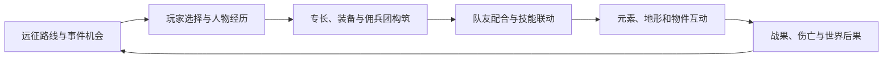

# 肉鸽成长、技能联动与战场互动设计 v0.3

2026-09-19补充：人物深化的最新分析见 [属性、培养与命运](13-character-progression.md)，长期繁衍/童年教育与时间尺度见 [家庭与代际传承](14-family-and-legacy.md)。均为待验证提案，当前实际实现以STATUS为准；本文保留此前系统框架，不代表本轮全部实施。

更新：2026-09-17。本文是本项目的原创设计提案，数值与内容数量需要原型验证。来源事实分别见 [PTR 调研](research/ptr-findings.md)、[肉鸽叙事调研](research/roguelite-findings.md)、[元素与场景调研](research/elements-findings.md)。研究报告中的备选方案不自动成为项目规则；当前取舍以本文和总体方案为准。

用户已确认：佣兵团在战役内持续成长，每次远征随机事件与奖励，失败承担伤亡和损失。首版集中实现这一种模式。

## 1. 四类系统组成一条循环

随机事件改变可选择的构筑，构筑改变战场计划，场景让计划产生不同价值，战果再改变之后能遇到的事件。用有限的共用状态，例如破绽、标记、湿润，连接多个技能；先用少量角色证明互动，再扩充数量。

## 2. 肉鸽的时间尺度与继承

| 层级 | 保留什么 | 结束或失败 |
| --- | --- | --- |
| 战斗，目标约 10–20 分钟 | 位置、行动资源、伤害、回合状态 | 地表与短期状态通常清除，伤亡和目标结果进入结算 |
| 远征，提案约 45–90 分钟 | 分支路线、补给、事件承诺、临时祝福／负担、奖励机会 | 回营清除标注的远征效果；幸存者、伤残、装备、报酬与永久成长保留 |
| 战役，首版约 6–10 小时 | 队伍、聚落、阵营关系、成长与故事线 | 主线结局或无可恢复的佣兵团覆灭结束，普通撤退不重置战役 |
| 战役之外 | 首版仅纪念册、结局和图鉴 | 不叠加永久攻击、生命或经济优势；新起源解锁另行评估 |

一次远征先设计 3–5 个地点或事件节点，通常 1–3 场战斗。关键主线遭遇手工固定，其间路线、支线和奖励从合格池抽取。路线节点仍处于同一个持续变化的边境地区。

保留手动和自动存档。候选事件、奖励和成长选项生成后落盘，读取同一存档不会因重新打开菜单而重抽。玩家仍可重试战术；铁人模式另行评估。

撤退和远征终止都要结算：带回实际幸存者和能够携带的已取得物品，兑现消耗与世界后果，未完成契约奖励不发。保留低风险短契约等恢复通道，不把一次失败变成必然连续破产。

## 3. 有约束的事件随机性

采用“手工情境 + 条件与角色槽位 + 有限变化 + 可追踪后果”。更换人物姓名不算新的事件内容。

生成顺序：先过滤地点、剧情阶段、存活角色、阵营与资源条件；预留必要补给／退出机会和至少一个与当前队伍相关的机会；按类别与近期记录加权；生成并保存候选与参与人物；选择后写入经历、关系、债务或地图变化。

每次远征最多追踪两个重要事件承诺。普通短事件结算后收束，关键链条有角色死亡、缺席或资源不足的替代路径。失败可以带来信息或后续机会，但不自动发放更强奖励；高风险选择需要可理解的线索。

原型仍只有 6 个事件节点：2 个主线锚点、4 个可选事件，其中包含一次后果回访。它们计入已有剧情预算。

## 4. 角色成长：保留方向，随机提供机会

出身、武器、专长、经历和佣兵团路线共同形成角色。招募时展示主要成长方向，让玩家可以规划前排、支援与控制。

建议关键成长节点通常提供三个不同且合法的选项：一个基础方向选项、一个相容联动选项、一个可用拓展选项；至少保留一个基础方向选项。这是本项目提案，不是对 PTR 原规则的描述。

候选必须校验前置条件、互斥、装备取得路径与已选能力。没有战犬时，不让只增强战犬的专长成为唯一可用选择；池不足时用预定义通用训练补位；每类训练限选一次，仍不足则显示实际数量，不能用重复项凑数。原型准备足够候选，先做一次三选一；1.0 再验证约第 2／4／6／8 级四次关键选择。

永久专长主要来自成长与重大事件。远征临时战术修正最多同时装备两个，回营结束；原型只支持一个。界面明确区分期限。经历特质来源于真实选择，例如救援队友、承担誓约、火灾幸存；同类重大经历限制重复，不能靠反复挨打刷无限成长。营地提供有成本的有限重训。

## 5. 技能联动：创造条件、利用条件、承担代价

| 构筑 | 创造条件 | 利用条件 | 成本与反制 |
| --- | --- | --- | --- |
| 守线与破阵 | 盾击制造破绽或改变位置 | 长枪指定攻击消耗破绽，或占住通路 | 行动点与站位成本；敌人可换线、后撤、远程压制 |
| 驯兽与追猎 | 驯兽师标记，战犬在自身回合牵制 | 猎手取得更可靠的射击窗口，战犬阻止逃跑 | 战犬占名额与补给；威胁主人、护卫与重甲可以反制 |
| 元素与控场 | 道具、物件或施术改变地表 | 火区封路、蒸汽切断远程视线，迫使敌人移动 | 消耗道具或行动；敌我同受影响，对手可灭火或绕行 |

原型只做一条完整物理联动：“盾击产生破绽 → 长枪攻击消耗破绽取得明确收益”。原型先测试一项命中加值，幅度由第 3–6 周对照试玩校准；破甲与疲劳效率保留为后续替代试验，不同时叠多个收益。破绽不叠层，在生成轮 N 的 N+1 轮末到期；指定长枪攻击合法并支付成本后锁定收益、立即消耗，未命中也消耗，取消或非法行动不消耗。

状态需要稳定 ID、来源、期限、叠加与消耗规则、图标。初版不加入无上限的击杀返还行动点、免费回合和互相无限触发的被动。改变回合经济的能力单独测试。

## 6. 元素、地表、区域效果与单位状态分开

| 对象 | 最小模型 | 边界 |
| --- | --- | --- |
| 地图基础 | 可站立地面、障碍、路径 | 普通魔法不任意改变几何 |
| 地表 | 干燥、油、水；后续加冰 | 同格一个主要地表 |
| 区域效果 | 无、火区、蒸汽 | 同格最多一个此类效果 |
| 单位状态 | 破绽、标记；后续加湿润、燃烧 | 地表灭火不自动移除已离开该格的人身上的状态 |
| 可互动物件 | 油罐、水桶、木制掩体 | 共用受击、破坏和交互流程 |

### 当前反应白名单

| 编号 | 输入与条件 | 结果与消耗 | 阶段 |
| --- | --- | --- | --- |
| R01 | 油地表接触点火 | 消耗油，形成有限持续的火区，不无限向邻格传播 | 前 12 周 |
| R02 | 水施加到火区，或点火施加到水地表 | 清除火区／转化点火，保留水并形成短暂蒸汽，遮挡远程视线 | 前 12 周 |
| R03 | 水作用于燃烧单位 | 清除燃烧，附加湿润，不恢复已损失生命 | 品质试玩后按需加入 |
| R04 | 雷击命中湿润单位 | 消耗湿润，增加一份明确的震击伤害；派生伤害不再触发武器命中被动 | 1.0 机制验证 |
| R05 | 冰寒作用于水地表 | 形成短期冰面、提高通过成本；不随机滑倒或连续硬控 | 1.0 机制验证 |
| R06 | 点火作用于冰面 | 冰变水，本次不继续把新水转成蒸汽；下一次输入才重新判断 | 1.0 机制验证 |

未列出的组合默认没有特殊反应。数量是排期上限，所有反应不必同时进入首个 Demo。

直击伤害与地表反应分别结算、预览。例如火焰直接击中水中的人，可能同时造成直击伤害和地表蒸汽；灭火不会撤销已发生伤害。后续启用湿润状态后，单位进入水格或在水格开始自身回合时刷新湿润，雷击消耗后不在同一结算中立即重新获得。

火区在生成于脚下、单位进入、单位回合开始时检查伤害；同一单位每个全局轮次最多承受一次火区接触伤害，计数随存档保存。强制位移同样检查进入格，穿越多个火格不会在一次推动中反复扣血。自身燃烧是另一种状态，原型不启用。

验证初值：在全局第 N 轮生成的火区和蒸汽均在第 N+1 轮末到期，保证末位行动者制造的效果也会覆盖下一轮；界面显示确切到期轮次，不只写模糊的“一回合”。刷新同类区域取较晚到期时点，不额外触发同轮伤害。

### 场景互动顺序

第一批：打破油罐铺油、打破水桶浇水、摧毁木制掩体。复用攻击、破坏、地表规则，并影响敌我双方。点火攻击打破油罐时，先结算直接伤害与破坏铺油，再对新油地执行本次唯一的点火反应；冰化水等反应产物不在该输入内递归反应。

第二批：阀门改变有限区域水面，推动目标离开掩体或进入危险格，破坏仪式装置改变任务目标。被推向占用格、不可站立格或地图外时，停止在最后合法位置；首版不加入坠崖秒杀和碰撞连击。强制位移不触发脱离反击，逐格处理危险地表；单位死亡立即终止位移及要求目标存活的后续效果。

之后评估桥梁坍塌、大范围天气、复杂垂直地形、整图自由破坏。它们改变寻路和任务可达性，不能当作普通装饰直接扩量。

## 7. 一个串联全部系统的样板

《渡桥的钟声》的村落段增加“雨夜粮仓”变体。远征事件提供有限选择：带走水具、帮助猎户获得后续驯兽机会、或提前赶路换取补给优势。关键推进道具不完全交给随机抽取。

战斗中，盾兵制造破绽、长枪利用破绽；点燃油罐可以封路，却威胁粮仓；打破水桶灭火形成蒸汽，遮断敌方弓手，也影响己方射手。

结算记录救出了谁、粮仓是否被毁、补给与契约结果。救援经历可打开成长选项，毁粮改变后续补给或村民事件。下一次远征遇到新的机会，佣兵团继续存在。战犬在独立实验验证后再接入。

## 8. 技术约束、预览与 AI

共用最小定义：来源、目标、标签、触发时点、条件、成本、效果、期限和次数限制。先实现样板需要的伤害、状态增减、有限位移、地表替换、任务标记；不提前建设万能技能编辑器。

每次行动有唯一编号。检查行动合法性后，先从既有状态计算并锁定命中、护甲和成本修正；支付成本并处理消耗型状态，再建立效果计划，按固定阶段处理直接伤害、物件破坏与铺设、一次元素反应、位移及进入格效果、由攻击结果引发的获准专长触发。生命归零立即停止该单位的后续主动触发；同阶段对象按稳定 ID 排序。反应读取对应阶段的明确快照；新地表不会在同一个输入中无限重新匹配。

同一被动对同一行动、同一目标默认至多触发一次；派生伤害默认不触发直接命中专长；队列采用稳定顺序；原型派生深度最多两层。内容校验拒绝已知循环，运行上限只是防护，达到上限需记录可复现错误，不能用静默截断掩盖设计问题。

战斗、事件、成长候选、战利品使用独立随机流；粒子不消耗玩法随机数。保存已生成候选、事件参与者、反应次数、奖励领取状态和内容版本。预览不抽取或推进随机数。

预览显示直接效果、确定的地表变化、友军风险与不确定分支；命中不确定时区分命中和未命中结果，不泄露实际随机结果。动画播放同一事件序列，跳过仅缩短表现。

AI 先识别危险格、友伤、掩体变化、灭火和可完成的单步联动；采用候选评分与有限前瞻，不搜索全部多角色组合。敌人与玩家遵守相同地表和状态规则。

## 9. 验证与扩量条件

| 风险 | 必须验证 |
| --- | --- |
| 成长失去方向 | 合格池至少一个基础方向选项；互斥、满级、无前置和池不足均有回退 |
| 随机事件卡死 | 所需角色死亡、缺席、资源为零或目标已毁时，仍能推进或明确结算 |
| 读档重复领奖 | 候选与状态恢复一致，同一奖励 ID 只能领取一次 |
| 无限触发与重复伤害 | 反击、派生伤害、击杀、火区重入不产生循环，限制可复现 |
| 反应顺序不明 | 当前已接入反应的不同输入顺序、火击破油罐、刷新、无效输入、到期边界；不默认全部可交换 |
| 位移错误 | 主动、强制、阻挡、多个危险格、单位死亡后的后续动作 |
| 预览与演出偏差 | 正常、加速、跳过与存读档后的最终规则状态一致 |
| 场景破坏软锁 | 出口、居民与任务物件损坏后，仍可离开或进入失败结算 |
| 单一套路垄断 | 同等预算与成长下比较物理、元素、混合队，至少一场不依赖元素也能合理完成 |

自动模拟用于查错与看分布，不能证明好玩。第 12 周测试增加：能否解释反应原因、为成长选择说明理由、失败后调整计划。

扩量前先通过约 20 组固定种子的短流程回归与代表性交互检查；数量是工作目标，按缺陷分布调整。每增加一条反应或触发，先更新验证矩阵，再扩展表现与内容。
